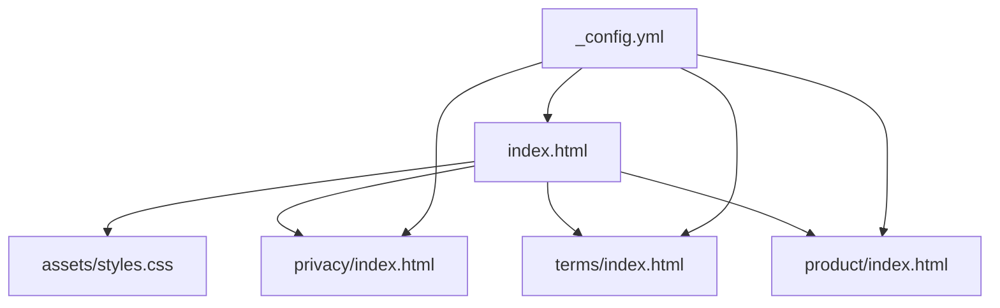

# Website Maintenance Guide

## Purpose

This repository hosts the public marketing and legal pages for OverLog on GitHub Pages.

## Current Structure

## Routing Rules

- Use relative links only (for project-page compatibility on GitHub Pages).
- Do not use root links like `/privacy/` because they can break on `username.github.io/repository-name`.
- Preferred links:
  - `privacy/`
  - `terms/`
  - `product/`

## Homepage Sections

`index.html` is a marketing page with:

- Hero and primary CTA
- Feature section aligned with the app's progressive overload positioning
- Screenshot placeholders for product images
- Footer legal links to privacy and terms pages

## Screenshot Placeholder Replacement

Each placeholder is represented by `.shot-frame` blocks in `index.html`.

To replace with real screenshots:

1. Add image files to a stable location (example: `assets/screens/`).
2. Replace the placeholder content with `` tags.
3. Keep the 9:16 visual ratio for phone screenshots to preserve layout consistency.

## Styling System

`assets/styles.css` contains shared styles for:

- Marketing homepage components
- Legal document pages (`.doc`)
- Footer and navigation consistency

When changing colors or spacing, update CSS variables in `:root` first.

## GitHub Pages Configuration

`_config.yml` excludes Markdown duplicates of pages to avoid conflicts with HTML routes.

## Content Source Alignment

Homepage messaging is aligned with product details from `progressive-overload2` docs:

- No account required
- Fast workout logging
- Progressive overload workflow
- PR and trend tracking
- Optional Apple Health / iCloud capabilities
